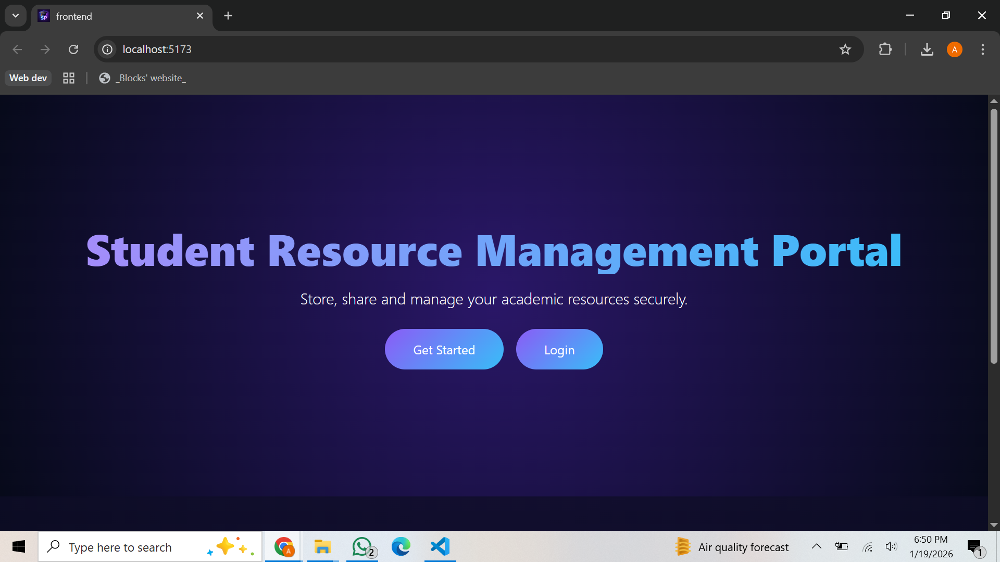
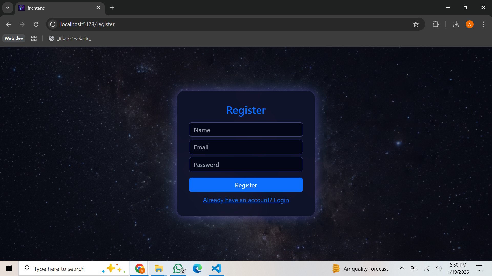
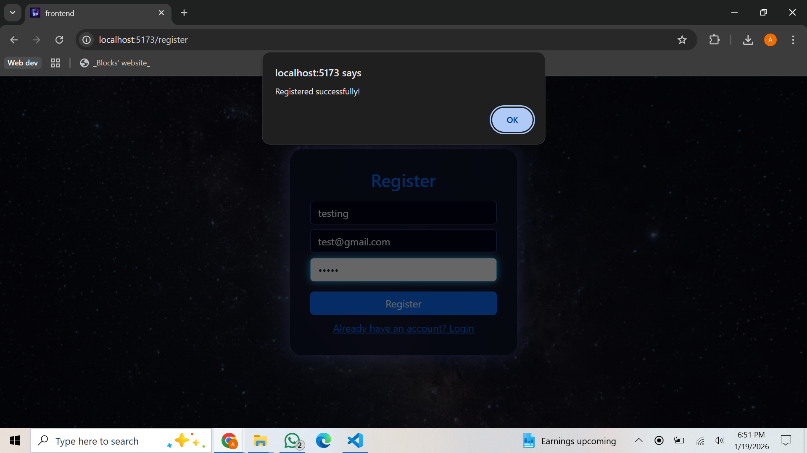
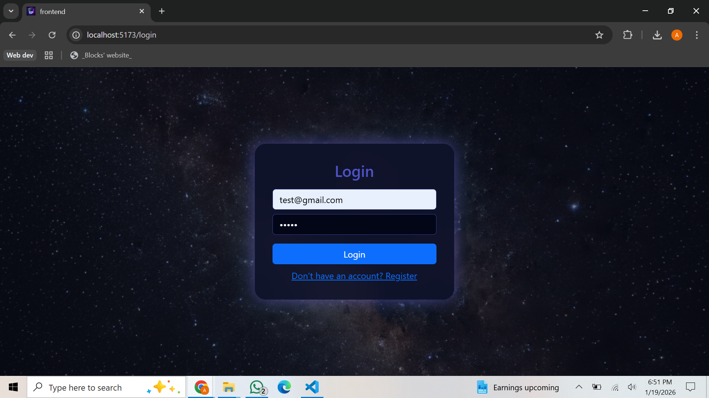
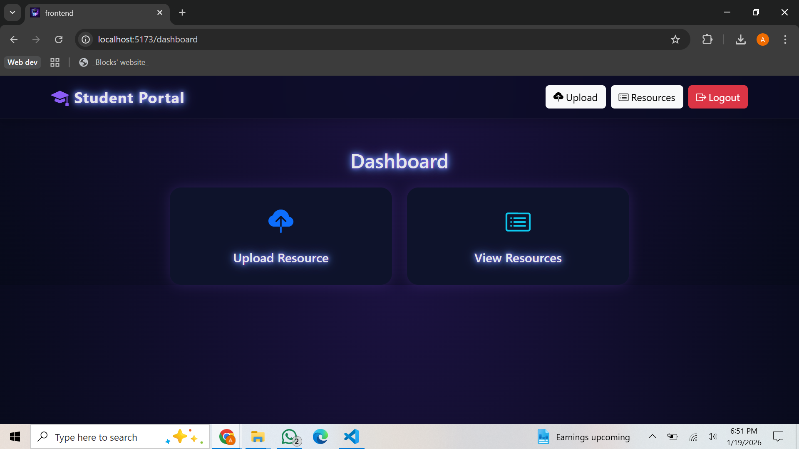
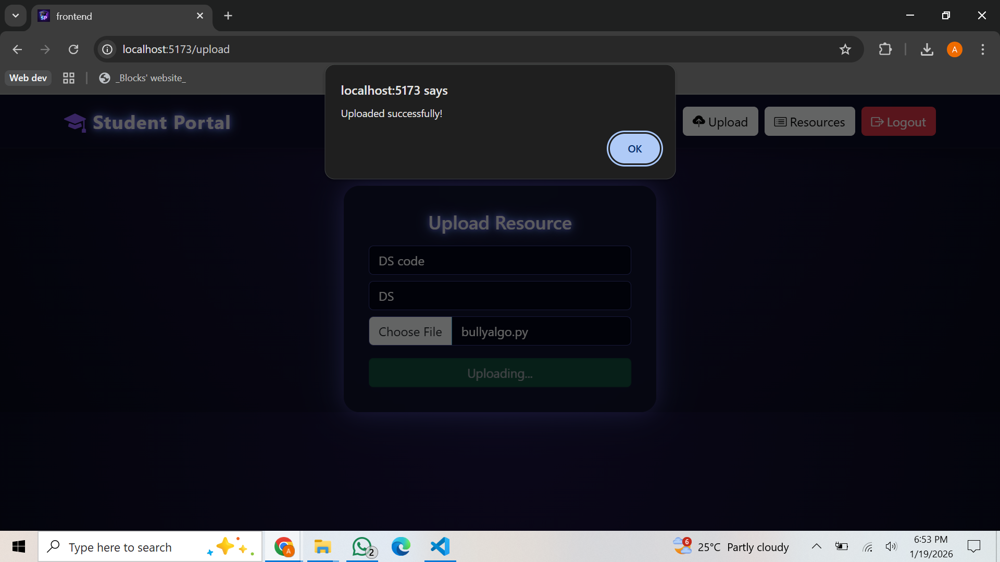
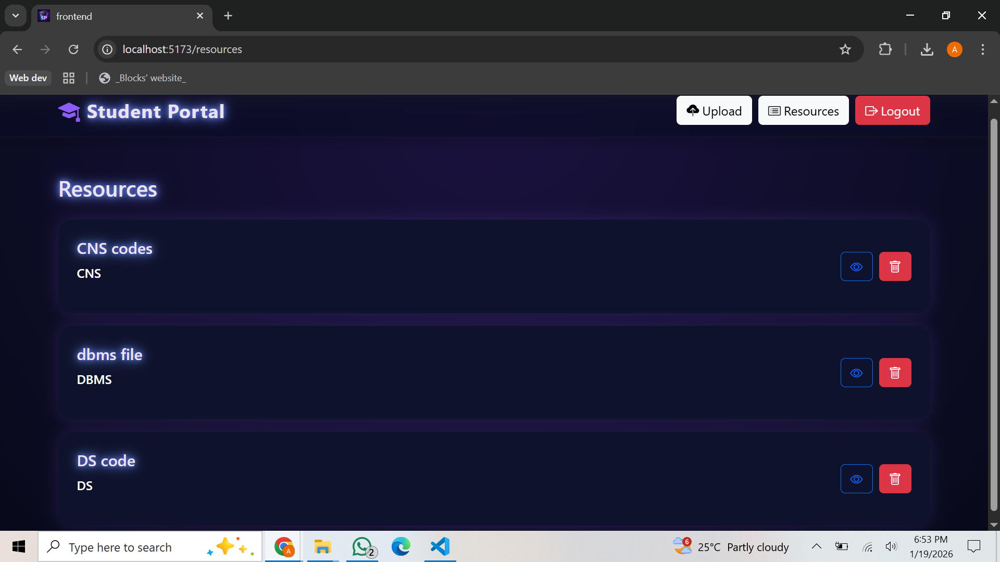

# 📚 Student Resource Management Portal


### Project Link: https://student-resource-management-system.vercel.app/

A full-stack MERN application that allows students to securely upload, manage, and access academic resources.

---

## 🚀 Features

- User Authentication (Register / Login with JWT)
- Protected Routes using Token-based Authentication
- Upload Resources (PDF, Notes, Files, etc.)
- View Personal Uploaded Resources
- Delete Resources (Only by Owner)
- File Upload using Multer
- Secure API with JWT Middleware

---

## 🛠️ Tech Stack

**Frontend:**

- React.js
- React Router DOM
- Axios
- Bootstrap

**Backend:**

- Node.js
- Express.js
- MongoDB
- Mongoose
- JWT (JSON Web Token)
- Multer

---

## 📂 Project Structure

frontend/
├─ src/
│ ├─ api/
│ ├─ components/
│ ├─ pages/
│ ├─ utils/
│ └─ context/

backend/
├─ controllers/
├─ routes/
├─ middleware/
├─ models/
└─ uploads/

---

## 📸 Screenshots

### 🏠 Home Page
The landing page of the Student Resource Management Portal, providing a brief overview of the platform with options to get started or log in.


### 📝 Register Page
New users can create an account by providing their name, email, and password.


### ✅ Registration Successful
Confirmation message displayed after successful user registration.


### 🔐 Login Page
Allows registered users to securely log in using their email and password.


### 📊 Dashboard
The main dashboard where users can navigate to upload resources or view their uploaded materials.


### 📤 Upload Resource
Users can upload academic resources by providing a title, subject, and selecting a file.


### 📚 View Resources
Displays a list of uploaded resources with options to view or delete them.


---

## ⚙️ Installation & Setup

### 1️⃣ Clone the Repository

```bash
git clone https://github.com/your-username/your-repo-name.git
cd your-repo-name

### 2️⃣ Backend Setup
cd backend
npm install

Create a .env file
MONGO_URI=your_mongodb_connection_string
JWT_SECRET=mySecretKey
PORT=3003

Run the server
npm start

### 3️⃣ Frontend Setup
cd frontend
npm install
npm run dev
```

---

### 🔐 API Endpoints
Method	Endpoint	Description
POST	/api/auth/register	Register User
POST	/api/auth/login	Login User
POST	/api/resources	Upload Resource (Protected)
GET	/api/resources	Get User Resources
DELETE	/api/resources/:id	Delete Resource (Protected)

---

### 🧪 Authentication Flow

On successful login, JWT is stored in localStorage

Axios Interceptor automatically attaches token to every request

Backend validates token using Middleware

---

### 👩‍💻 Author

Anvesha Goydani

GitHub: https://github.com/anvesha987

LinkedIn: https://www.linkedin.com/in/anvesha-goydani-b7b774293

---
